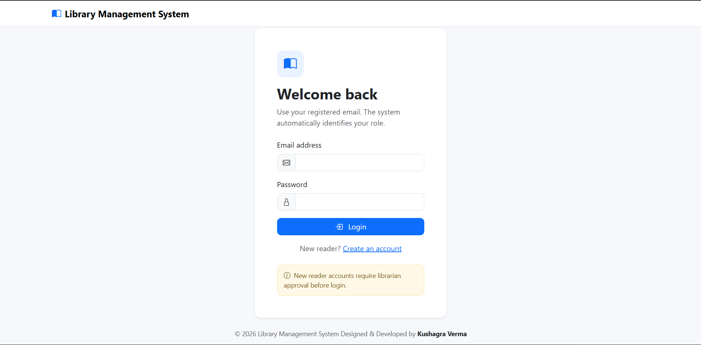
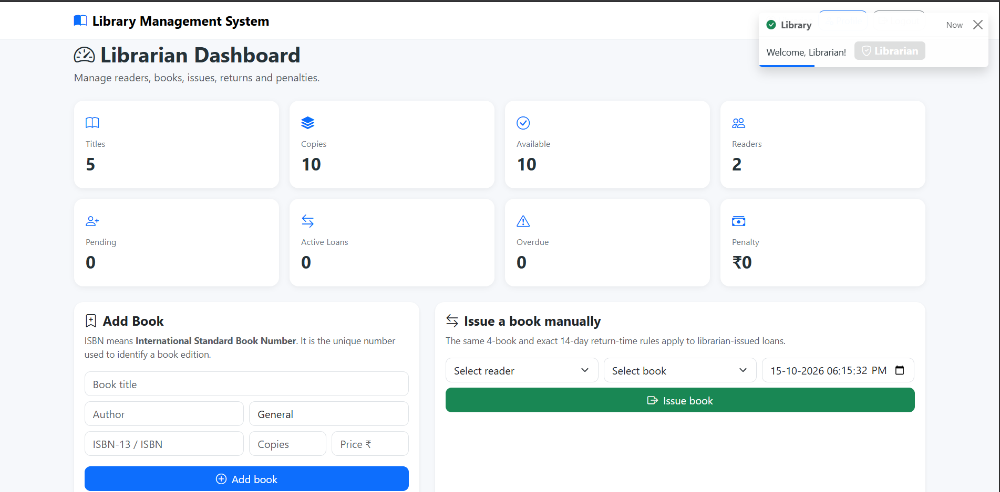
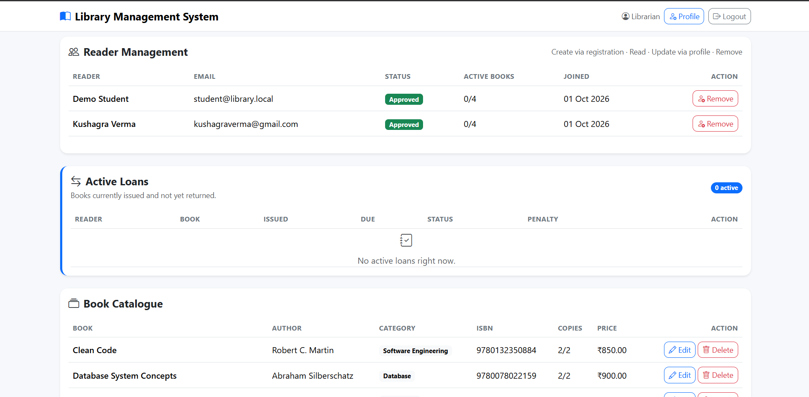
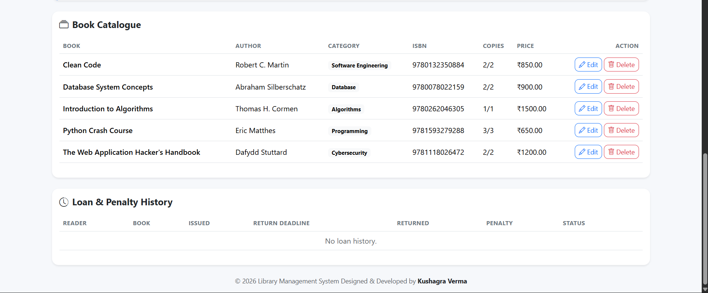
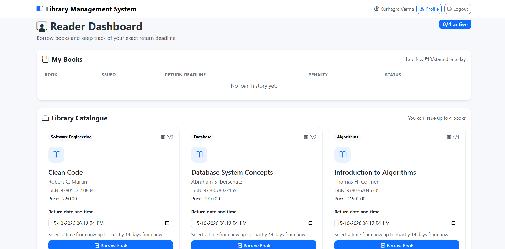
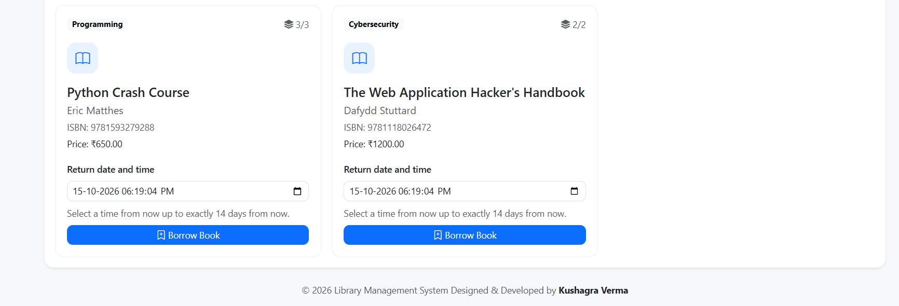

# Library Management System

A simple **Library Management System** built with Flask, SQLite, SQLAlchemy and Bootstrap.

The system supports two types of users:

- **Librarian**
- **Reader / Student**

Readers can register their accounts, borrow books, return books, manage their profiles and change their passwords. Librarians can manage users, books, loans and penalties.

## Features

### Reader / Student

- Register a new account
- Login after librarian approval
- View available books
- Borrow books
- Maximum 4 active books at a time
- Select return date and time
- Return books
- View active and previous loans
- View penalties
- Edit profile
- Change password
- Receive return reminders

### Librarian

- Login through the same login page
- Approve or reject reader registrations
- Remove readers
- View reader details
- Add books
- Edit books
- Delete books
- Manage book copies
- Issue books
- Mark books as returned
- View active loans
- View loan history
- View overdue books and penalties
- Change librarian password

### Loan & Penalty System

- Maximum 4 books per reader
- Return date and time are required
- Past date/time is not allowed
- Maximum return period is 14 days
- Return time is validated on the server
- Late return penalty is **₹10 per day**
- Penalty cannot exceed the price of the book
- Readers receive a reminder when the return deadline is close

## Technologies Used

- Python 3.14
- Flask
- Flask-SQLAlchemy
- SQLite
- HTML5
- CSS3
- Bootstrap 5
- Bootstrap Icons
- JavaScript

## Project Structure

```text
library_management_system/
│
├── app.py
├── requirements.txt
├── README.md
├── library.db
│
├── templates/
│   ├── base.html
│   ├── book_form.html
│   ├── change_password.html
│   ├── librarian.html
│   ├── login.html
│   ├── profile.html
│   ├── reader.html
│   ├── register.html
│
└── static/
    ├── style.css
```
## Screenshots

### Login Page


### Librarian Dashboard


### Librarian Page 1


### Librarian Page 2


### Student Dashboard


### Student Page 2


## Installation

Clone the repository:

```bash
git clone https://github.com/kushagraverma-dev/Library_Management_System.git
```

Go to the project directory:

```bash
cd library-management-system
```

Create a virtual environment:

```bash
py -3.14 -m venv .venv
```

Activate the virtual environment on Windows:

```bash
.venv\Scripts\activate
```

Install the required packages:

```bash
pip install -r requirements.txt
```

## Run the Project

```bash
python app.py
```

Open the application in your browser:

```text
http://127.0.0.1:5000
```

The SQLite database is created automatically when the application starts.

## Demo Accounts

### Librarian

```text
Email: librarian@gmail.com
Password: Librarian@123
```

### Reader

```text
Email: kushagraverma@gmail.com
Password: Student@123
```

New readers can also create an account from the registration page. Their account will remain pending until a librarian approves it.

## Book Information

When adding a book, the librarian can enter:

- Book Title
- Author
- Category
- ISBN
- Number of Copies
- Book Price

### What is ISBN?

**ISBN** stands for **International Standard Book Number**.

It is a unique identification number assigned to a book or a particular edition of a book.

Example:

```text
9780132350884
```

## Database

The project uses **SQLite** with **Flask-SQLAlchemy**.

The database stores information about:

- Users
- Books
- Book loans
- Return dates
- Penalties
- Account status

## Future Improvements

Some possible improvements for future versions:

- Email notifications
- Search and filtering
- Book cover images
- Fine payment tracking
- PDF reports
- Admin activity logs
- REST API
- Deployment with PostgreSQL or MySQL

## License

This project is created for learning and educational purposes.
